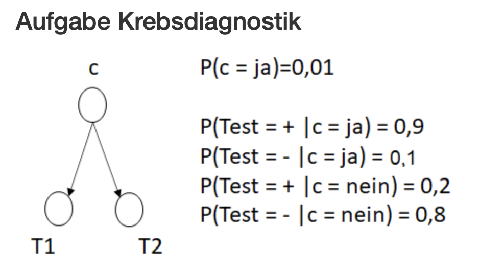

```{r setup, include=FALSE}
knitr::opts_chunk$set(echo = TRUE)
```

## Cluster - Aufgabe 2 Skript 

Einlesen der Daten und Darstellung. Da der Datensatz nur 3 Variablen hat, bietet sich 3D Darstellung an. Aber auch andere Darstellungen sind möglich!

```{r}
library(tidyverse)
cluster.dat <- read_csv2( "cluster_example.csv")
# 3D Darstellung
library(plotly)
plot_ly(
  cluster.dat, x = ~Z1, y = ~Z2, z = ~Z3) %>%
  add_markers()
```

EM Algorithmus ist im Paket **mclust** implementiert. Bei Clusterverfahren muss sich Gedanken zur Wahl der Anzahl an Clustern gemacht werden, z.B. mittels Betrachtung Informationskriterien wie BIC.

```{r}
# EM Algorithmus
library(mclust)

# Anzahl an Clustern
BIC <- mclustBIC(cluster.dat, G=1:10, model = c("EII", "EEI"))
plot(BIC)
```


Der in diesem Paket implementierte Algorithmus hat zur Bestimmung der Startwerte hierarchisches Clustern implementiert und entscheidet darüber auch die Wahl der Cluster. 

```{r}
# Cluster - Hierarchiches Clustern zur Initialisierung
# Auswahl Cluster = 2
mc <- Mclust (cluster.dat)
# Ergebnis
summary ( mc )
```

Die ersten 6 Zeilen der Matrix mit den Wahrscheinlichkeiten, dass eine Beobachtung entweder zu Cluster 1 oder zu Cluster 2 gehört. 

```{r}
head(mc$z)
```

Darstellung mit der Farbe gemäß der Klasse, die die größte Wahrschenlichkeit hat. 

```{r}
plot_ly(
  cluster.dat, x = ~Z1, y = ~Z2, z = ~Z3,
  color = mc$classification) %>%
  add_markers()
```

```{r}
# Ausprobieren von 3 Clusterklassen
# eine Klasse ist staerker besetzt als die zwei anderen Klassen
mc.3 <- Mclust (cluster.dat, G=3)
summary(mc.3)
```

```{r}
# 3D grafik mit Farbe der zugeordneten Cluster
plot_ly(
  cluster.dat, x = ~Z1, y = ~Z2, z = ~Z3,
  color = mc.3$classification) %>%
  add_markers()
```


## Bayessche Netze
Weitergehende Infos zum R Paket gRain z.B. in der Publikation https://www.jstatsoft.org/article/view/v046i10

Hinweise zur Installation: https://people.math.aau.dk/~sorenh/software/gR/

Quelle der Beispiele: http://www.di.fc.ul.pt/~jpn/r/bayesnets/bayesnets.html (Abruf 17.12.2020)

```{r, eval = FALSE}
if (!requireNamespace("BiocManager", quietly = TRUE))
    install.packages("BiocManager")
BiocManager::install(version = "3.18")
BiocManager::install(c("graph", "RBGL", "Rgraphviz"))

```

```{r, eval= FALSE}
install.packages("gRbase", dependencies=TRUE); 
install.packages("gRain", dependencies=TRUE); 
install.packages("gRim", dependencies=TRUE)
```

### Aufgabe Krebsdiagnostik

 
```{r, message=FALSE, warning=FALSE}
library(gRain)
library(gRbase)
library(gRim)
#library(Rgraphviz)
```


```{r}
# the possible values (all nodes are boolean vars)
yn <- c("yes","no")

# specify the CPTs
node.C <- cptable(~ C, values=c(1, 99), levels=yn)
node.T1 <- cptable(~ T1 + C, values=c(9,1,2,8), levels=yn)
node.T2 <- cptable(~ T2 + C, values=c(9,1,2,8), levels=yn)

# create an intermediate representation of the CPTs
plist <- compileCPT(list(node.C, node.T1, node.T2))
plist
```

```{r}
plist$C
```

```{r}
plist$T1
```

```{r}
# create network
bn.cancer <- grain(plist)
summary(bn.cancer)
```

```{r}
# The marginal probability for each variable:
querygrain(bn.cancer, nodes=c("C", "T1", "T2"), type="marginal")
```

```{r}
# The joint probability P(C,T1):
querygrain(bn.cancer, nodes=c("C","T1"), type="joint")
```

```{r}
# P(T1=+ | T2=+):
#  1. add evidence to the net
bn.cancer.1 <- setFinding(bn.cancer, nodes=c("T2"), states=c("yes")) 
#  2. query the new net
querygrain(bn.cancer.1, nodes=c("T1"))
```

```{r}
# The probability of this evidence:
# print(getFinding(bn.cancer.1))
# The conditional P(not C | not T1)
bn.cancer.2 <- setFinding(bn.cancer, nodes=c("T1"), states=c("no")) 
querygrain(bn.cancer.2, nodes=c("C"))
```

### Aufgabe Koronare Herzkrankheit

```{r}
data("cad1")
head(cad1)
```

```{r}
# create the DAG
dag.cad <- dag(~ CAD:Smoker:Inherit:Hyperchol + 
                 AngPec:CAD + 
                 Heartfail:CAD + 
                 QWave:CAD)

```


```{r}
plot(dag.cad)
```

```{r}
# smooth is a small positive number to avoid zero entries in the CPTs
# (cf. Additive smoothing, http://en.wikipedia.org/wiki/Additive_smoothing)
bn.cad <- grain(dag.cad, data = cad1, smooth = 0.1)
```


```{r}
# Let's ask some questions...
querygrain(bn.cad, nodes=c("CAD", "Smoker"), type="conditional") 
```

